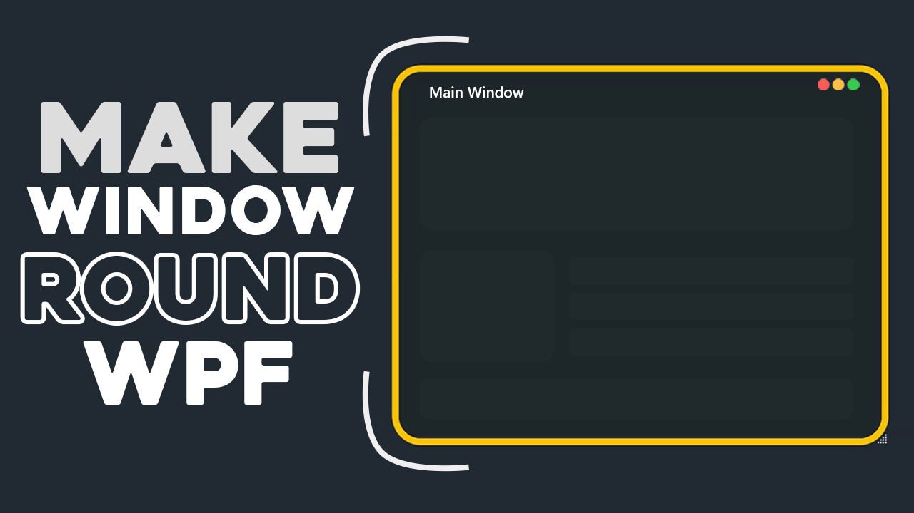

# Make Round Window in WPF

Youtube Tutorial: [Watch](https://youtu.be/1mo1wgM2sPU)

Youtube Channel: [Click here to visit](https://www.youtube.com/@CodeCrunch.Official)

My Github: [Click here to navigate](https://github.com/MAHMAD6)